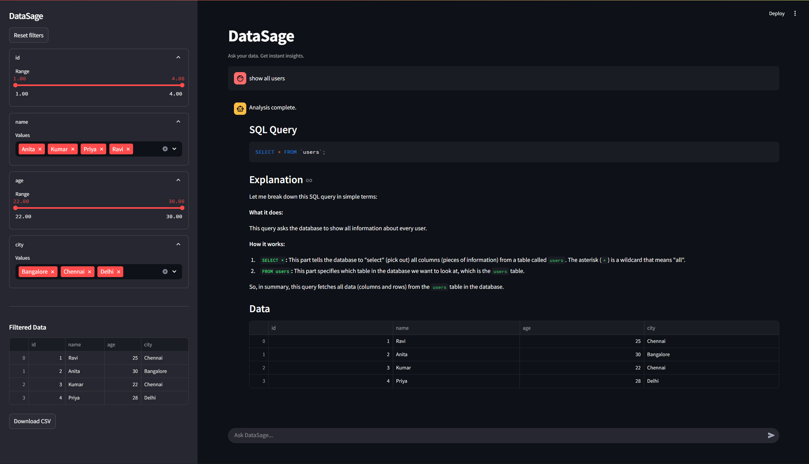

# DataSage

DataSage is an AI-powered SQL assistant that lets you query a MySQL database using natural language. Ask questions in plain English, and it generates safe SQL queries, executes them, and explains the results instantly.

---

## Demo

[](https://github.com/SudharsaaX/DataSage)

Or preview below:


---

## Overview

DataSage combines a local large language model with a database backend to translate natural language into SQL queries. It ensures safe execution, returns structured results, and explains each query so users understand what is happening.

---

## Features

* Natural language to SQL conversion using a local LLM
* Safe query execution (read-only queries only)
* SQL explanation in plain English
* Interactive chat-based interface
* Dynamic sidebar filters for data exploration
* CSV export for filtered results
* Fully local setup with no external API dependency

---

## Tech Stack

* Python
* FastAPI
* Streamlit
* MySQL
* Ollama (Llama 3.1)
* Pandas

---

## How It Works

1. Enter a question in natural language
2. LLM converts it into a SQL query
3. Safety layer validates the query
4. Query executes on MySQL
5. Results are displayed in the UI
6. LLM explains the query

---

## Project Structure

```
DataSage/
│
├── app/
│   ├── main.py        # FastAPI backend
│   ├── llm.py         # LLM logic
│   ├── db.py          # Database connection
│   ├── safety.py      # Query validation
│   ├── ui.py          # Streamlit frontend
│
├── outputs/           # Screenshots and demo GIF
├── .env.example
├── requirements.txt
├── README.md
```

---

## Setup Instructions

### 1. Clone the repository

```
git clone https://github.com/SudharsaaX/DataSage.git
cd DataSage
```

---

### 2. Create virtual environment

```
python -m venv venv
venv\Scripts\activate
```

---

### 3. Install dependencies

```
pip install -r requirements.txt
```

---

### 4. Configure environment variables

Create a `.env` file:

```
DB_HOST=localhost
DB_USER=root
DB_PASSWORD=your_password
DB_NAME=ai_sql_db
```

---

### 5. Run local LLM (Ollama)

```
ollama run llama3.1:8b
```

---

### 6. Start backend

```
uvicorn app.main:app --reload
```

---

### 7. Start frontend

```
streamlit run app/ui.py
```

---

## Example Queries

* Show all users
* Show users in Chennai
* Show users older than 25
* Show orders above 3000

---

## Screenshots

### Main Interface


---

## Safety

* Only SELECT queries are allowed
* Dangerous operations are blocked
* Invalid queries return safe fallback results

---

## Future Improvements

* Context-aware conversations
* Query optimization
* Advanced visualizations
* Deployment support
* User authentication

---

## Author

<p align="center">
  
</p>

<h3 align="center">Sudharsan S</h3>

<p align="center">
  <a href="https://github.com/SudharsaaX">
    
  </a>
</p>

---

## License

This project is for educational and demonstration purposes.
